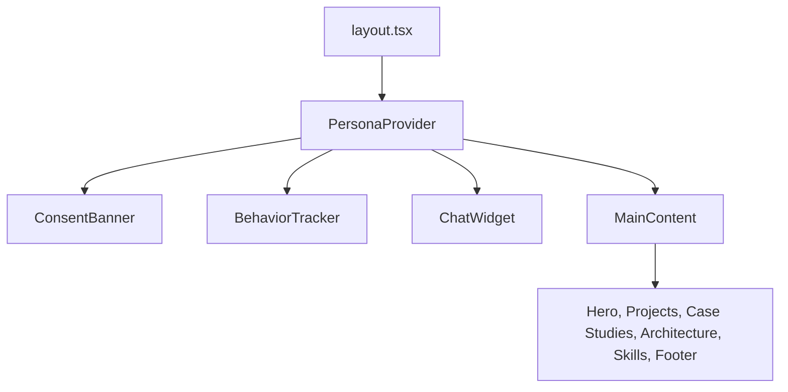
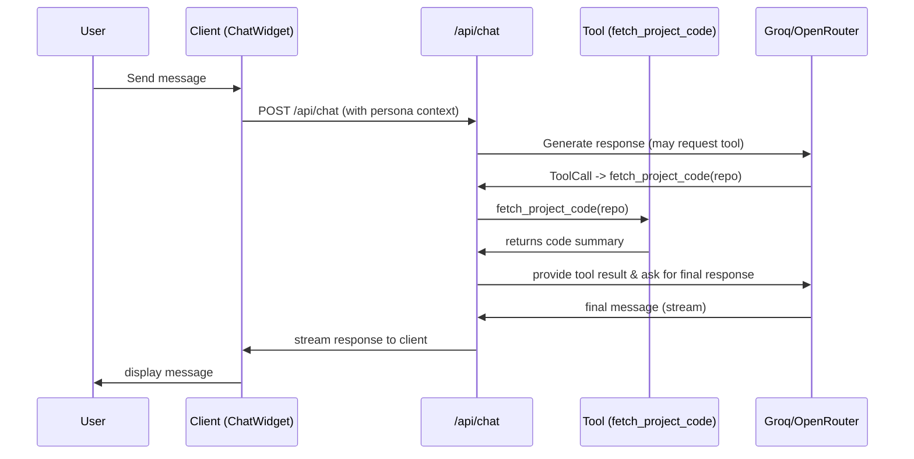
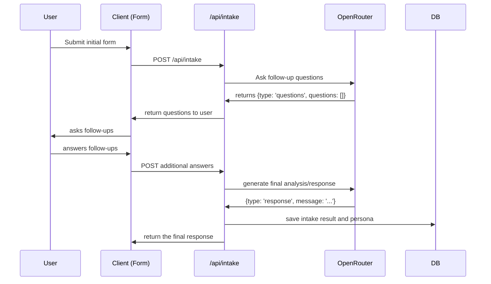

# Architecture Overview

This document describes the core architecture of the Adaptive Developer portfolio and the high-level interactions between the client, the server, external services, and major components.

## System Overview

```mermaid
flowchart LR
  subgraph Client
    C[Browser Client] -->|Behaviors| BT[BehaviorTracker]
    C -->|Requests| ChatWidget[ChatWidget]
  end

  BT -->|Edge POST| TrackAPI[/api/track (Edge)/]
  TrackAPI --> DB[(Neon PostgreSQL)]

  C -->|Chat| ChatAPI[/api/chat (30s)/]
  ChatAPI --> AI[Groq/OpenRouter]
  ChatAPI --> DB

  CronJob[/Daily Cron - /api/cron/aggregate/] -->|Aggregate| DB
  CronJob -->|Upsert| Aggregated[aggregated_behaviors]

  NotionWebhook[/Notion Webhook -> /api/notion/revalidate/] -->|Revalidate| RevalidateAPI[/api/notion/revalidate/]
  RevalidateAPI --> NextCache[Next.js revalidate endpoints]

  UploadThing --> UploadAPI[/api/uploadthing/]
  UploadAPI --> DB
  UploadAPI --> UploadStorage[(UploadThing/Cdn)]

  DB -->|CMS data| NextSSR[Next.js Server]
  NextSSR --> Client
```

## Component Hierarchy



## Data Flow (Simplified)

1. Client loads page -> BehaviorTracker starts capturing events
2. Behavior events are batched and sent to `/api/track` using the Edge runtime
3. Raw logs are stored in `behavior_logs` and `sessions`
4. Cron job runs daily (3:00 UTC) to create `aggregated_behaviors` vectors
5. `usePersona` queries `/api/persona/classify` to identify persona and store it in session/localStorage
6. Chat UI uses both persona context and CMS content to produce responses and optionally calls tools like `fetch_project_code`

### Chat Tool Calling Sequence



### Intake Flow (Multi-turn)




## Security & Privacy

- GDPR compliance via consent banner; data retained 7 days for raw logs and 30 days for aggregated data.
- Admin endpoints are protected with a session cookie (`admin_session`) and token-based routes use `CRON_SECRET` or `REVALIDATION_SECRET`.

----

Links:
- Database schema: `docs/database-schema.md`
- API Reference: `docs/api-reference.md`
- Persona flow: `docs/persona-system.md`

