# Architecture Documentation: The Adaptive Developer
### AI-Powered Multi-Layer Persona Detection with Real-Time Behavioral Adaptation

## 1. Context & Challenge

### Background
Traditional portfolios are static—offering the same experience for every visitor. A recruiter sees the same layout as a curious learner. This creates friction: recruiters must hunt for credentials, engineers must decode marketing copy, and CTOs miss strategic insights.

The **Adaptive Developer** solves this by treating the portfolio as an intelligent feedback system that observes visitor intent in real-time and reshapes the interface around their role.

> **Evidence:** Behavior collection happens via client-side event tracking documented in `docs/persona-system.md` and implemented in `src/components/tracking/BehaviorTracker.tsx`.

### Target Audience
*   **Primary:** Recruiters, developers, CTOs, designers evaluating a portfolio.
*   **Secondary:** Curious learners, gamers exploring interactive experiences.
*   **Use Case:** Job search, collaboration outreach, portfolio inspiration, career discovery.

### Core Problem
1.  **Attribution Gap:** Portfolios don't adapt to visitor intent → friction & drop-off.
2.  **Content Overload:** Single layout tries to serve everyone → diluted messaging.
3.  **Missed Opportunities:** Recruiters miss niche skills; engineers miss leadership credentials.

**Solution:** Real-time behavioral classification + dynamic content adaptation.

---

## 2. Solution Architecture

### High-Level Approach
The system captures raw user behaviors on the client, processes them via Edge functions, and uses a scheduled background process to classify users into specific personas using K-Means clustering and LLMs.


### System Architecture Diagram
The full stack leverages Next.js 16 on Vercel, using Edge Runtime for low-latency tracking and Node.js for heavy compute (AI/Cron).

```mermaid
graph TB
    subgraph Client ["Client (Browser)"]
        UI["UI Components<br/>(React 19)"]
        BT["BehaviorTracker<br/>(Events)"]
        PersonaHook["usePersona Hook<br/>(Context)"]
        Chat["ChatWidget"]
        UI -->|events| BT
        UI -->|persona| PersonaHook
        UI -->|questions| Chat
    end

    subgraph API ["Edge & Server APIs"]
        TrackEdge["🌐 /api/track<br/>(Edge Runtime)"]
        PersonaAPI["⚙️ /api/persona/classify"]
        ChatAPI["🤖 /api/chat"]
        CronAPI["⏰ /api/cron/aggregate"]
        NotionHook["🔗 /api/notion/revalidate"]
    end

    subgraph DB ["Database Layer"]
        BehaviorLogs["behavior_logs<br/>(Raw, TTL: 7d)"]
        AggBehaviors["aggregated_behaviors<br/>(Vectors, TTL: 30d)"]
        CMS["CMS Tables<br/>(Profile, Skills, Certs)"]
        Sessions["sessions<br/>(Persona, Confidence)"]
    end

    subgraph AI ["External AI Services"]
        Groq["🧠 Groq<br/>(Llama 3.1 8B)"]
        OpenRouter["🤖 OpenRouter<br/>(GPT fallback)"]
    end

    subgraph External ["External Services"]
        Notion["📝 Notion<br/>(CMS)"]
        UploadThing["☁️ UploadThing<br/>(File Storage)"]
        GitHub["🐙 GitHub API<br/>(Skills Extraction)"]
    end

    Client -->|POST behavior| TrackEdge
    TrackEdge -->|store| BehaviorLogs
    CronAPI -->|aggregate| BehaviorLogs
    CronAPI -->|vectorize + classify| PersonaAPI
    PersonaAPI -->|K-means + LLM| Groq
    PersonaAPI -->|fallback| OpenRouter
    PersonaAPI -->|store result| Sessions
    PersonaAPI -->|response| PersonaHook
    
    Chat -->|POST message| ChatAPI
    ChatAPI -->|with persona context| Groq
    ChatAPI -->|fallback| OpenRouter
    
    NotionHook -->|webhook| TrackEdge
    NotionHook -->|revalidate| CMS
    
    External -->|sync| CMS
    Client -->|query| CMS
```



### Component Hierarchy
The React tree is designed to wrap the main content in a `PersonaProvider`, allowing state to flow down to UI components which adapt their rendering logic (Section Order, Mobile Prompts, etc.).

```mermaid
graph TD
    Root[app/layout.tsx] --> Provider[PersonaProvider]
    
    Provider --> Consent[ConsentBanner]
    Provider --> Tracker[BehaviorTracker]
    Provider --> Chat[ChatWidget]
    Provider --> Observer[Observer (Dev Mode)]
    Provider --> Mobile[MobilePrompt]
    Provider --> Dev[DevTools]
    
    Provider --> Main[main / HomeClient]
    
    Main --> Hero
    Main --> About
    Main --> Projects
    Main --> Skills
    Main --> Certificates
    Main --> CaseStudies
    Main --> Architecture
    Main --> Contact
    Main --> Footer
```

---

## 3. Key Innovations & Data Logic

### 12-Dimensional Behavior Vector (`src/lib/clustering/vectors.ts`)
Raw events are normalized into machine-learning-ready features. This vectorization allows us to mathematically map a user's intent.


### Full Data Flow Sequence
This sequence details the lifecycle of a user session: from the first page load and consent, through the event tracking loop, to the asynchronous nightly classification job.

```mermaid
sequenceDiagram
    participant U as Visitor
    participant C as Browser Client
    participant Track as /api/track (Edge)
    participant DB as PostgreSQL
    participant Cron as /api/cron/aggregate
    participant Classify as /api/persona/classify
    participant Groq as Groq API
    participant Hook as usePersona Hook

    U->>C: Lands on homepage
    activate C
    C->>C: usePersona Hook initializes
    C->>C: BehaviorTracker attaches listeners
    C->>C: Shows ConsentBanner
    
    U->>C: Accepts consent
    
    C->>Track: POST event: {type: 'pageview', ...}
    Track->>DB: Insert into behavior_logs
    C->>Track: POST event: {type: 'scroll', depth: 45}
    Track->>DB: Insert into behavior_logs
    C->>Track: POST event: {type: 'click', target: 'projects'}
    Track->>DB: Insert into behavior_logs
    deactivate C
    
    Note over Cron: Daily 3am UTC
    activate Cron
    Cron->>DB: SELECT behavior_logs WHERE age < 1 day
    Cron->>Cron: FOR EACH session: vectorize() → 12D vector
    Cron->>Classify: POST /api/persona/classify
    activate Classify
    Classify->>Classify: computeSimilarity(vector, CENTROIDS)
    Classify->>Classify: IF confidence > 0.5: return persona
    Classify->>Classify: ELSE: callLLM(vector)
    Classify->>Groq: POST behavior summary
    Groq->>Classify: Return persona classification
    Classify->>DB: Upsert aggregated_behaviors
    deactivate Classify
    Cron->>DB: DELETE behavior_logs WHERE age > 7 days
    Cron->>DB: DELETE aggregated_behaviors WHERE age > 30 days
    deactivate Cron
    
    C->>Classify: GET /api/persona/classify
    Classify->>DB: Query aggregated_behaviors
    Classify->>Hook: {persona: 'engineer', confidence: 0.82}
    Hook->>Hook: Update Context + localStorage
    Hook->>C: Re-render with new section order
    C->>U: UI adapts (projects first, architecture visible)
```



---

## 4. Feature Implementation

### Feature 1: Persona-Aware AI Chatbot
The chatbot uses Groq (Llama 3.1) for high-speed inference. It is context-aware (knows the user's persona) and can perform tool calling to fetch specific code snippets or project details from the database/Notion.


### Feature 2: Multi-turn Intake Flow
The contact/intake form is not static. It uses AI to ask follow-up questions based on the user's initial input to gather a complete picture before submission.


---

## 5. Database Design

### Database Schema (ER Diagram)
The database distinguishes between ephemeral data (raw behavior logs with short TTL) and persistent content (Profile, CMS, and refined Persona Sessions).


**Key TTLs (Privacy):**
*   `behavior_logs`: 7 days (raw event data)
*   `aggregated_behaviors`: 30 days (behavioral patterns)
*   `sessions`: Indefinite (needed for persona tracking)

---

## 6. Stack Analysis

### Frontend Layer
*   **Next.js 16:** App Router, Server Components, ISR.
*   **React 19:** `use()` hooks, automatic batching.
*   **State:** React Context, localStorage, TanStack Query.
*   **Styling:** Tailwind CSS 4, Framer Motion 12.

### Backend Layer
*   **Runtime:** Edge Runtime (Tracking), Node.js 20+ (Chat/Compute).
*   **Database:** Neon PostgreSQL, Drizzle ORM.
*   **AI:** Groq (Llama 3.1 8B), OpenRouter (Fallback), Tool Calling.

### Architectural Decisions
1.  **Hybrid K-Means + LLM Classification:** Fast K-means locally (< 1ms) for 70% of visitors; OpenRouter LLM fallback for ambiguous edge cases.
2.  **Notion CMS Over Custom Backend:** Content is managed in Notion for ease of use, synchronized via Webhooks.
3.  **Drizzle ORM:** Chosen for lightweight bundle size and Edge compatibility.
4.  **Groq for Chat:** Prioritizing speed (840 tokens/sec) for a conversational feel.
5.  **Edge Runtime for Tracking:** Ensures <50ms latency for behavior collection to prevent UI blocking.
