# Architecture Overview

This document describes the core architecture of the Adaptive Developer portfolio and the high-level interactions between the client, the server, external services, and major components.

# Solution Architecture

## High-Level Approach


## System Architecture Diagram

```mermaid
graph TB
    subgraph Client ["Client (Browser)"]
        UI["UI Components<br/>(React 19)"]
        BT["BehaviorTracker<br/>(Events)"]
        PersonaHook["usePersona Hook<br/>(Context)"]
        Chat["ChatWidget"]
        UI -->|events| BT
        UI -->|persona| PersonaHook
        UI -->|questions| Chat
    end

    subgraph API ["Edge & Server APIs"]
        TrackEdge["🌐 /api/track<br/>(Edge Runtime)"]
        PersonaAPI["⚙️ /api/persona/classify"]
        ChatAPI["🤖 /api/chat"]
        CronAPI["⏰ /api/cron/aggregate"]
        NotionHook["🔗 /api/notion/revalidate"]
    end

    subgraph DB ["Database Layer"]
        BehaviorLogs["behavior_logs<br/>(Raw, TTL: 7d)"]
        AggBehaviors["aggregated_behaviors<br/>(Vectors, TTL: 30d)"]
        CMS["CMS Tables<br/>(Profile, Skills, Certs)"]
        Sessions["sessions<br/>(Persona, Confidence)"]
    end

    subgraph AI ["External AI Services"]
        Groq["🧠 Groq<br/>(Llama 3.1 8B)"]
        OpenRouter["🤖 OpenRouter<br/>(GPT fallback)"]
    end

    subgraph External ["External Services"]
        Notion["📝 Notion<br/>(CMS)"]
        UploadThing["☁️ UploadThing<br/>(File Storage)"]
        GitHub["🐙 GitHub API<br/>(Skills Extraction)"]
    end

    Client -->|POST behavior| TrackEdge
    TrackEdge -->|store| BehaviorLogs
    CronAPI -->|aggregate| BehaviorLogs
    CronAPI -->|vectorize + classify| PersonaAPI
    PersonaAPI -->|K-means + LLM| Groq
    PersonaAPI -->|fallback| OpenRouter
    PersonaAPI -->|store result| Sessions
    PersonaAPI -->|response| PersonaHook
    
    Chat -->|POST message| ChatAPI
    ChatAPI -->|with persona context| Groq
    ChatAPI -->|fallback| OpenRouter
    
    NotionHook -->|webhook| TrackEdge
    NotionHook -->|revalidate| CMS
    
    External -->|sync| CMS
    Client -->|query| CMS
```



## Component Hierarchy

```mermaid
graph TD
    Root[app/layout.tsx] --> Provider[PersonaProvider]
    
    Provider --> Consent[ConsentBanner]
    Provider --> Tracker[BehaviorTracker]
    Provider --> Chat[ChatWidget]
    Provider --> Observer[Observer (Dev Mode)]
    Provider --> Mobile[MobilePrompt]
    Provider --> Dev[DevTools]
    
    Provider --> Main[main / HomeClient]
    
    Main --> Hero
    Main --> About
    Main --> Projects
    Main --> Skills
    Main --> Certificates
    Main --> CaseStudies
    Main --> Architecture
    Main --> Contact
    Main --> Footer
```

## Data Flow Sequence


## Database Schema (ER Diagram)


## System Overview


## Component Hierarchy


### Chat Tool Calling Sequence


### Intake Flow (Multi-turn)


# Database Schema


## UML: Behavior Types


## Security & Privacy

- GDPR compliance via consent banner; data retained 7 days for raw logs and 30 days for aggregated data.
- Admin endpoints are protected with a session cookie (`admin_session`) and token-based routes use `CRON_SECRET` or `REVALIDATION_SECRET`.

----

Links:
- Database schema: `docs/database-schema.md`
- API Reference: `docs/api-reference.md`
- Persona flow: `docs/persona-system.md`

