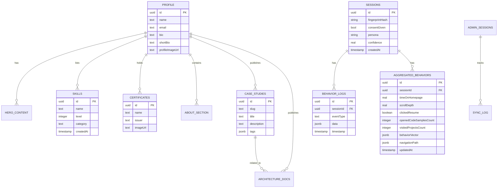

# Database Schema

This is a simplified ER diagram of the database schema defined in `src/lib/db/schema.ts`.

## Notes
- TTLs: `behavior_logs` -> 7 days (cron cleanup). `aggregated_behaviors` -> 30 days cleanup.
- All CMS tables support `notionId` for syncing from Notion.
