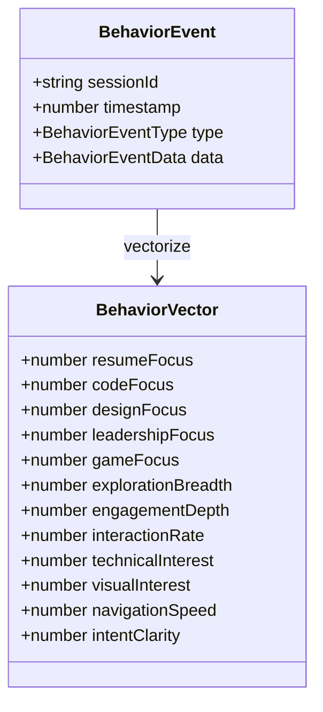

# Persona System & Behavior Vectors

This document explains how visitor behavior is converted into a 12-dimensional vector, how personas are classified using pre-computed centroids, and what each dimension represents.

## Behavior Vector (12 Dimensions)
Each vector dimension is normalized to 0-1.

1. resumeFocus - Resume/experience interactions
2. codeFocus - Code samples, GitHub interaction
3. designFocus - Design, visuals, case studies
4. leadershipFocus - Architecture, methodology
5. gameFocus - Games, demos, interactive elements
6. explorationBreadth - Navigation variety (unique pages)
7. engagementDepth - Time spent, scroll depth
8. interactionRate - Clicks, interactions per minute
9. technicalInterest - Technical content engagement
10. visualInterest - Visual content engagement
11. navigationSpeed - Fast scanner vs deep reader
12. intentClarity - Focused vs wandering

## Persona Centroids (12D)
These centroids are defined in `src/lib/clustering/centroids.ts`.

| Persona | Vector values (12D) |
|---------|----------------------|
| recruiter | [0.9, 0.2, 0.2, 0.3, 0.1, 0.4, 0.4, 0.6, 0.3, 0.3, 0.7, 0.8] |
| engineer | [0.2, 0.9, 0.3, 0.5, 0.4, 0.6, 0.8, 0.7, 0.9, 0.3, 0.4, 0.7] |
| designer | [0.2, 0.3, 0.9, 0.3, 0.4, 0.6, 0.7, 0.6, 0.3, 0.9, 0.5, 0.7] |
| cto | [0.5, 0.6, 0.4, 0.9, 0.2, 0.8, 0.7, 0.6, 0.7, 0.5, 0.5, 0.8] |
| gamer | [0.1, 0.4, 0.3, 0.1, 0.9, 0.7, 0.6, 0.9, 0.5, 0.6, 0.6, 0.5] |
| curious | [0.4, 0.4, 0.4, 0.3, 0.3, 0.5, 0.4, 0.4, 0.4, 0.4, 0.5, 0.3] |

## Classification Flow

1. Raw events are collected and aggregated into `aggregated_behaviors` (daily cron).
2. `behaviorToVector()` converts the aggregated metrics into a 12D vector.
3. `classifyByVector()` uses cosine similarity against `PERSONA_CENTROIDS`.
4. If Best Score >= 0.5 similarity => Confidence = (similarity - 0.5) * 2; result returned.
5. If Best Score < 0.5 => LLM-based fallback (`classifyWithAI()` via OpenRouter) for additional context.

## Reproducible Example (Node script)
You can emulate the classifier with a simple Node script using `createBehaviorVector` and `classifyByVector`.

```
// Example (psuedocode):
// const vector = createBehaviorVector({ resumeFocus: 0.9, codeFocus: 0.2, ... });
// const result = classifyByVector(vector);
// console.log(result);
```

## Tuning & Thresholds
- Similarity threshold (0.5) gives 0 confidence below 0.5. Increase/decrease based on tuning.
- Vector normalization thresholds are defined in `src/lib/clustering/vectors.ts`.

## UML: Behavior Types



